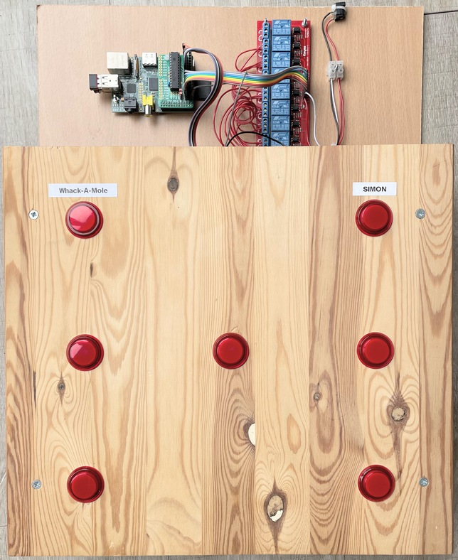
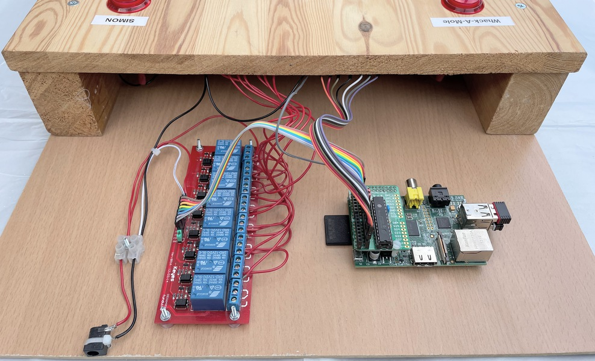

# ButtonBoard

Software created for a home-build "button board".  The board consists of 7 arcade-style buttons, each containing a light.
The board was build to be controlled with a Raspberry Pi.



The button lights are switched using an 8-way relay board.



A `ButtonBoard` class is defined in `buttonboard.py`.
Applications should interact with this class rather than accessing lower-level hardware commands.

## Applications

### Whack-a-mole

Hit the middle button (mole) to start, then keep hitting the lit button.
Maintains the lowest time taken.
Uses `espeak` (or `festival`) to speak the time and high score.

```
python whackamole.py
```
Exit with `Ctrl-C`

### Electronic Dice

Hit any button to roll the dice.
```
python dice.py
```
Exit with `Ctrl-C`

### Simon-style "follow-me" game

Hit any button to start.
Try to copy the pattern for as long as you can...

```
python simon.py
```
Exit with `Ctrl-C`

### Games selector

Wrapper around Simon and Whack-a-mole.
Uses two buttons to select which game to play.
Maintains the last and best score for each game.
High scores are saved and retrieved from a file (`.highscore_GAME`); delete the file to reset the high score.
Uses the curses library to give a very simple console-based UI.

```
python selector.py
```
Exit with `Ctrl-C`
